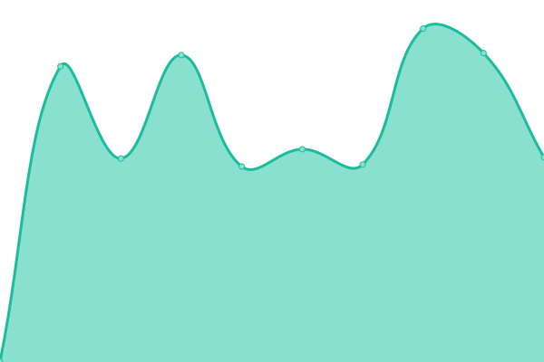

# [📈 Live Status](https://status.northoffalydojo.xyz): <!--live status--> **🟩 All systems operational**

This repository contains the open-source uptime monitor and status page for [North Offaly CoderDojo](https://northoffalydojo.xyz), powered by [Upptime](https://github.com/upptime/upptime).

With [Upptime](https://upptime.js.org), you can get your own unlimited and free uptime monitor and status page, powered entirely by a GitHub repository. We use [Issues](https://github.com/northoffalydojo/status/issues) as incident reports, [Actions](https://github.com/northoffalydojo/status/actions) as uptime monitors, and [Pages](https://status.northoffalydojo.xyz) for the status page.

<!--start: status pages-->
<!-- This summary is generated by Upptime (https://github.com/upptime/upptime) -->
<!-- Do not edit this manually, your changes will be overwritten -->
<!-- prettier-ignore -->
| URL | Status | History | Response Time | Uptime |
| --- | ------ | ------- | ------------- | ------ |
|  [Website](https://northoffalydojo.xyz) | 🟩 Up | [website.yml](https://github.com/northoffalydojo/statuspage/commits/HEAD/history/website.yml) | 

 113ms
     
 | 

<a href="https://status.northoffalydojo.xyz/history/website">100.00%</a>
    

|  [Docs](https://support.northoffalydojo.xyz) | 🟩 Up | [docs.yml](https://github.com/northoffalydojo/statuspage/commits/HEAD/history/docs.yml) | 

 238ms
     
 | 

<a href="https://status.northoffalydojo.xyz/history/docs">99.66%</a>
    

|  [Customer Portal](https://portal.northoffalydojo.xyz/support) | 🟩 Up | [customer-portal.yml](https://github.com/northoffalydojo/statuspage/commits/HEAD/history/customer-portal.yml) | 

 504ms
     
 | 

<a href="https://status.northoffalydojo.xyz/history/customer-portal">100.00%</a>
    

|  [Booking Page](https://ti.to/northoffalydojo) | 🟩 Up | [booking-page.yml](https://github.com/northoffalydojo/statuspage/commits/HEAD/history/booking-page.yml) | 

 763ms
     
 | 

<a href="https://status.northoffalydojo.xyz/history/booking-page">100.00%</a>
    

<!--end: status pages-->

[**Visit our status website →**](https://status.northoffalydojo.xyz)

## 📄 License

- Powered by: [Upptime](https://github.com/upptime/upptime)
- Code: [MIT](./LICENSE) © [North Offaly CoderDojo](https://northoffalydojo.xyz)
- Data in the `./history` directory: [Open Database License](https://opendatacommons.org/licenses/odbl/1-0/)
